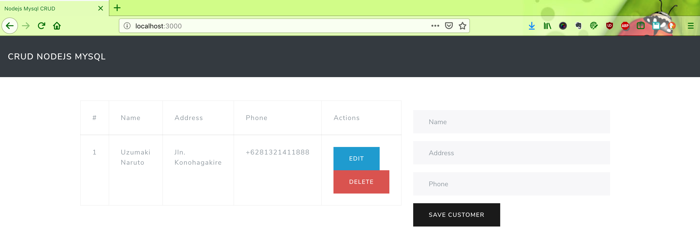
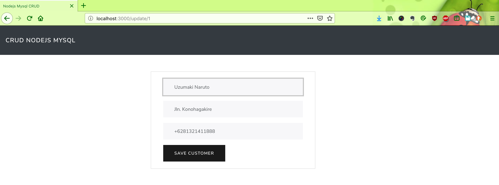

# nodejs-mysql-crud

Run this project by this command :

1. `npm install`
2. `nodemon src/index.js`
3. `localhost:3000`

#### Screen shot

Home Page

Add New Customer

#### ! EJS:------------------------------------------------------------------

Official Site: https://ejs.co/

        <% if (data && data.error){ %>
                    

                        <%= data.error %>
                    

                    <%}%>

<!-- 

    <% if(imgs.length > 0){ %>
        <% imgs.forEach(function(img) { %>
            /screenshots/<%= img %>">
        <% }); %>
    <% } else{ %>  
        
no photos uploaded

    <% } %>

 -->

 app.get('/hi/:param1', function(req,res){} );
and given this URL  http://www.google.com/hi/there?qs1=you&qs2=tube

You will have:

req.query

{
  qs1: 'you',
  qs2: 'tube'
}
req.params

{
  param1: 'there'
}# Blog_v2_Express
